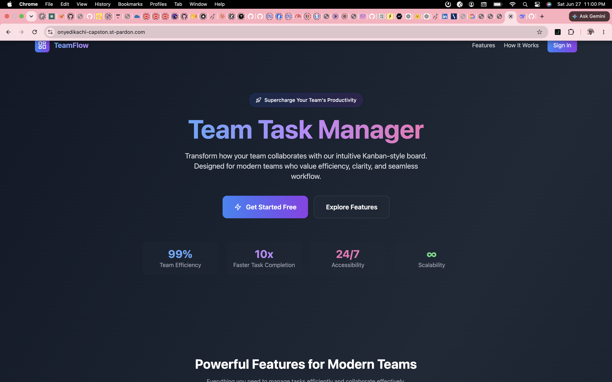
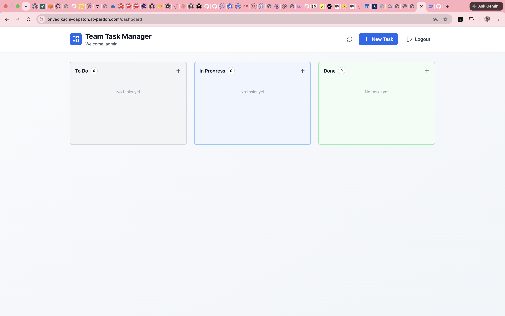
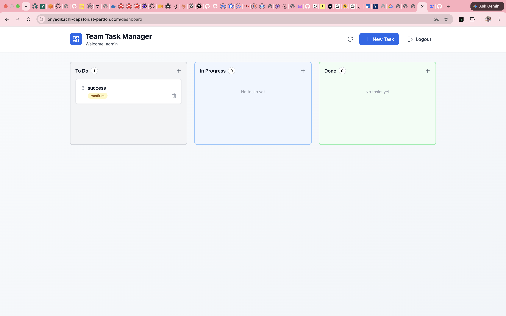
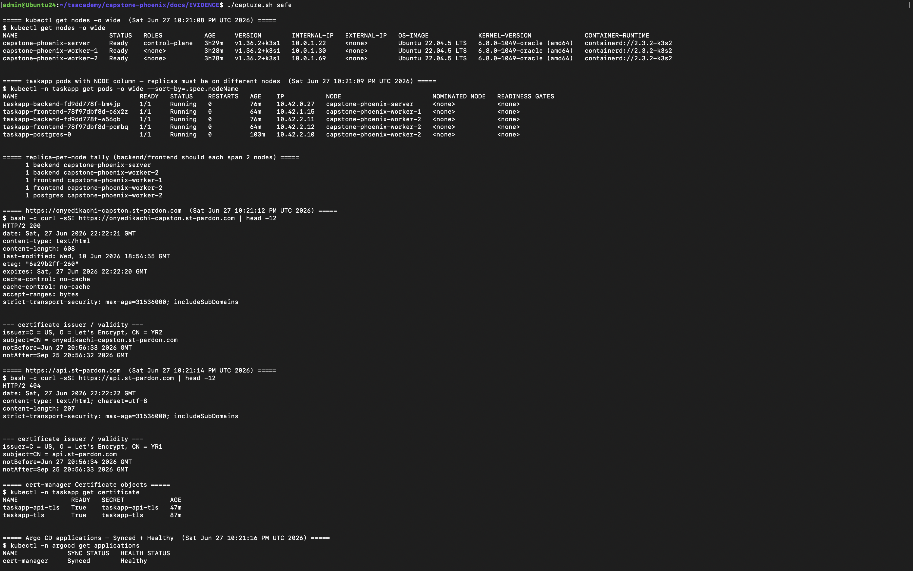
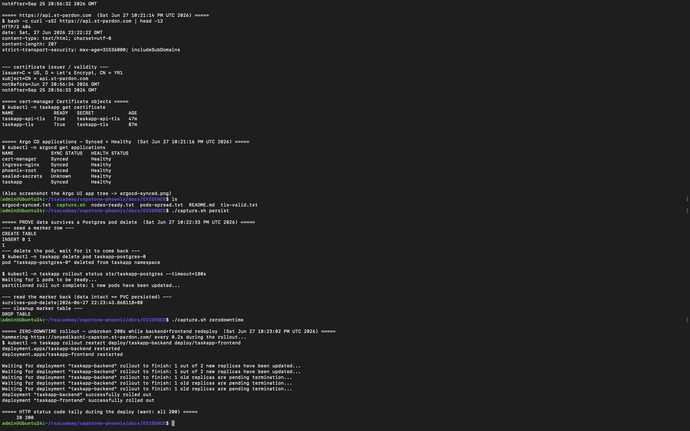
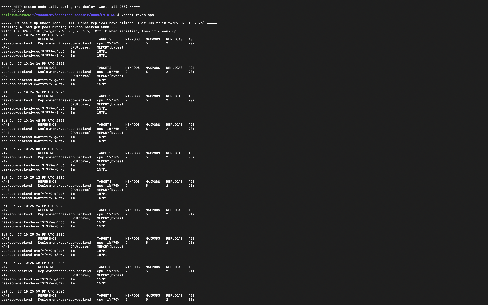
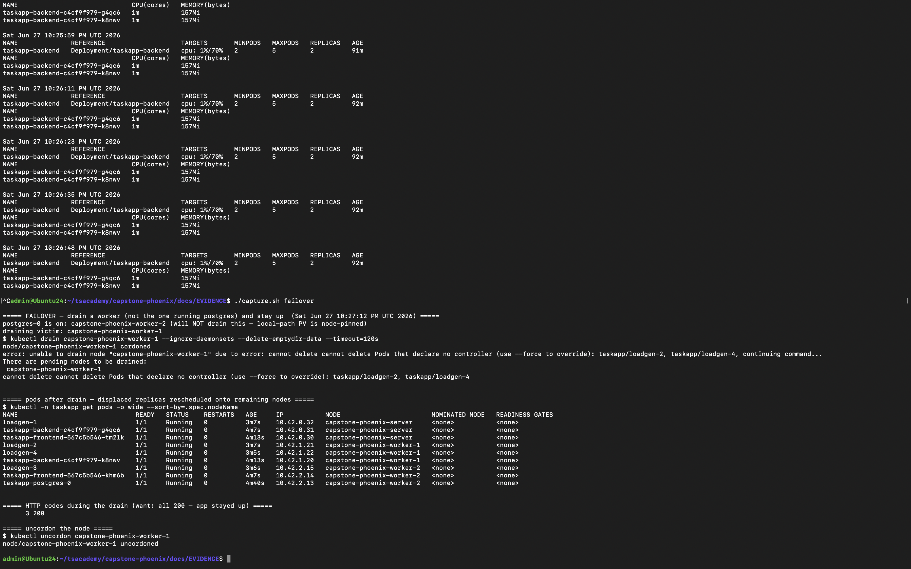

# EVIDENCE

Proof that the Phoenix TaskApp runs as the brief requires — live, HTTPS, multi-node, GitOps-owned.
Cluster shots were produced by the (local, gitignored) `capture.sh` helper; app shots are the live
site. All captured **2026-06-27**.

---

## 1. The app is live over HTTPS on a real domain

Landing page served at `https://onyedikachi-capston.st-pardon.com` (real Let's Encrypt cert):

Authenticated Kanban dashboard:

Creating a task persists through the backend to Postgres (proves the full request path
DNS → ingress → frontend → backend → DB):

---

## 2. Multi-node cluster, pod spread, and valid TLS on both hosts

`capture.sh safe` — three nodes `Ready` (1 server + 2 workers), backend/frontend replicas spread
across **different** nodes, and **valid Let's Encrypt certificates** (`issuer=Let's Encrypt`) on
both `onyedikachi-capston.st-pardon.com` and `api.st-pardon.com`, with both `Certificate` objects
`READY=True`:

> Note: `https://api.st-pardon.com/` returns `404` because the backend exposes no `/` route (the
> API lives under `/api`) — the **cert is valid**, which is what this evidence shows.

---

## 3. GitOps, data persistence, and zero-downtime

Argo CD applications **Synced + Healthy**; Postgres data **survives a pod delete** (PVC re-attaches,
marker row intact); and a rolling restart of both tiers serves **unbroken 200s** (`20 200`,
`maxUnavailable: 0`):

---

## 4. HPA reading live metrics

`HorizontalPodAutoscaler` on the backend reading live CPU from metrics-server (target `70%`,
`min 2 / max 5`):

> The light synthetic load held CPU at ~1%, so no scale-up event fired — this shows the HPA is
> wired and consuming metrics. A heavier load test (CPU > 70%) is needed to capture an actual
> 2→N scale-up.

---

## 5. Node-failure failover

Draining a worker (chosen so it is **not** the one pinning the Postgres `local-path` PV): displaced
replicas reschedule onto the remaining nodes and the app stays up (`200`s held during the drain),
then the node is uncordoned:

---

### Reproduce
The capture helper (`capture.sh`, local-only / gitignored) regenerates the cluster shots:
`./capture.sh safe | persist | zerodowntime | hpa | failover`.
